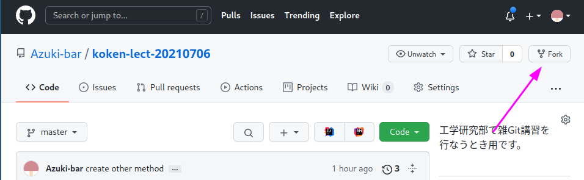
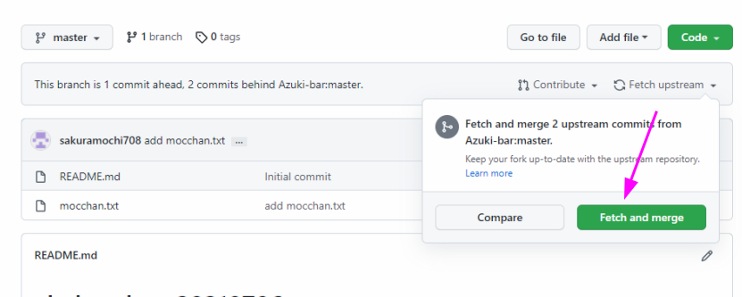
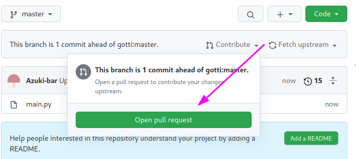
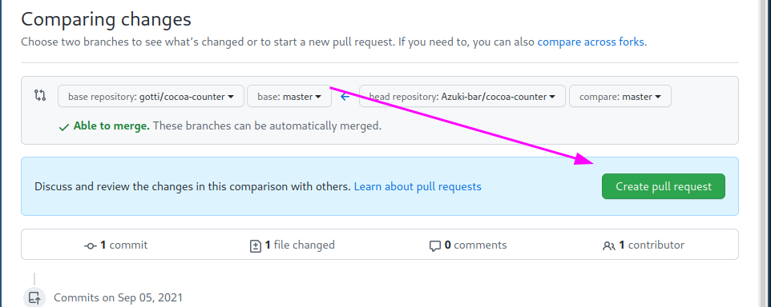

# 工研雑講習 Git 編

-   [工研雑講習 Git 編](#工研雑講習-git-編)
    -   [はじめに](#はじめに)
    -   [事前準備編](#事前準備編)
        -   [GitHub のアカウント作成](#github-のアカウント作成)
    -   [Git とは](#git-とは)
    -   [何が嬉しいの](#何が嬉しいの)
        -   [複数人で共同編集がしやすい](#複数人で共同編集がしやすい)
        -   [ファイルの状態を巻き戻せる](#ファイルの状態を巻き戻せる)
        -   [ブランチが作れる](#ブランチが作れる)
    -   [実践 Git](#実践-git)
        -   [Git と GitHub の違い](#git-と-github-の違い)
        -   [git のはじめかた](#git-のはじめかた)
            -   [ユーザ登録](#ユーザ登録)
    -   [実際に触る](#実際に触る)
        -   [GitHub のアカウントを作成する](#github-のアカウントを作成する)
        -   [`koken-lect-20210706`をフォークする。](#koken-lect-20210706をフォークする)
        -   [手元に最新のコードを取り寄せる。](#手元に最新のコードを取り寄せる)
        -   [Git のありがたみを知ろう](#git-のありがたみを知ろう)
        -   [手元の変更をみんなに知らせる](#手元の変更をみんなに知らせる)
        -   [プルリクエストを出してみよう](#プルリクエストを出してみよう)
        -   [ブランチの説明](#ブランチの説明)

## はじめに

この資料は 2021 年工学研究部オンライン合宿向けに作成されたものです。

また付録として Git コマンド集があります。[コマンド集](./commands/)

## 事前準備編

### GitHub のアカウント作成

この講習では GitHub を使用するので GitHub のアカウントを作成してください。
淵野アタリさんが講習してくれたらしい…………

## Git とは

> Git（ギット）は、プログラムのソースコードなどの変更履歴を記録・追跡するための分散型バージョン管理システムである。
> (引用: https://ja.wikipedia.org/wiki/Git)

Wikipedia にはこのように記載されています。
しかしこのままではどのようなものなのか」良く分からないでしょう。
ですから補足説明をします。

ソースコードを書いたときに「昨日のコードではしっかり動いていたのに今は動かない」
なんてことを経験したことは無いでしょうか。

このときに役に立つのが Git です。

Git は変更履歴を記録します。
どのファイルにどのように変更をしたのかを記録するので正常に動作していたときのコードを引っ張ってくることが出来ます。

そして多くの場合、その変更履歴を大人数で共有します。
そのことにより同期を怠らなければ常に新しい変更をチーム全体で役立てることが出来ます。

## 何が嬉しいの

-   複数人で共同編集がしやすい
-   ファイルの状態を巻き戻せる
-   ブランチが作れる

### 複数人で共同編集がしやすい

共同編集がしやすいように設計されています。

共同編集に付きものの同じ所を別の人が同時に変更してしまったりブランチ（後述します）を作成することで作業内容が衝突しないように出来たりします。

### ファイルの状態を巻き戻せる

その通りです。

```bash
git checkout
```

コマンドを使います。

### ブランチが作れる

作業の枝分かれです。

ブランチを切って行った作業は他人に一切影響を与えないです。
これがとても素晴らしい。

## 実践 Git

### Git と GitHub の違い

GitHub は Git を活用したサービスです。

### git のはじめかた

#### ユーザ登録

git は変更履歴にユーザ名とメールアドレスを紐づけます。

そのときに使うアカウント情報です。

```bash
git config --global user.name "外部に公開される名前"
git config --global user.email "外部に公開されるメールアドレス"
```

[参考文献](https://docs.github.com/ja/github/setting-up-and-managing-your-github-user-account/managing-email-preferences/setting-your-commit-email-address)

## 実際に触る

### GitHub のアカウントを作成する

```bash
# sol にログインする
ssh X9999999@sol.edu.cc.uec.ac.jp

# git が使えるかを確認する
git --version
# git version 2.27.0

# もし使えないときは
echo 'module load git/2.27.0' >> ~/.tcshrc
exit

mkdir git_lect
cd git_lect

```

### `koken-lect-20210706`をフォークする。

フォークとは他人の Git リポジトリ（Git で変更履歴が保存されているディレクトリ）をコピーすることです。
GitHub 特有の作業です。

[ここから飛ぶ](https://github.com/Azuki-bar/koken-lect-20210706)

#### Git/ GitHub 講習の受講が初めての人



`https://github.com/<USER_NAME>/koken-lect-20210706`が存在することを確認する。

#### すでに fork したことがある人

下画像の緑色のボタンを押す。


### 手元に最新のコードを取り寄せる。

#### Git/ GitHub 講習の受講が初めての人

```bash
git clone https://github.com/<USER_NAME>/koken-lect-20210706
cd koken-lect-20210706
```

#### すでに fork したことがある人

```bash
cd /path/to/koken-lect-20210706
git pull
```

### Git のありがたみを知ろう

`code`ディレクトリに移動し、中身を見る。

```bash
cd code
nano hello.rb
```

`hello.rb`の内部にある以下のコードを削除する。

```ruby
def hello()
  puts("Hello world!")
end

hello()
```

```bash
# hello.rb の変更を保存することを git に伝える
git add hello.rb

# 変更を保存する。
# ファイルの変更履歴をGitに保存する
git commit
# エディタが開く
# 1行目以降に変更の簡単な説明を書く（コミットメッセージと呼ばれています）
# もとからある部分は触らない
```

```bash
# git の保存履歴を確認する。
# commit ID と Author Date コミットメッセージが表示される
git log

#######
# 例
# commit 671e6b152c8ae0891e0c1591e997d86b0b8ce822 (HEAD -> master)
# Author: Azuki-bar <42642269+Azuki-bar@users.noreply.github.com>
# Date:   Sun Sep 5 01:15:54 2021 +0900
#
#     hello を削除しました。
#
# commit 92f1384a980748f1f4e47a60ab45ffbb67b0c7f4 (origin/master, origin/HEAD)
# Author: Azuki-bar <42642269+Azuki-bar@users.noreply.github.com>
# Date:   Sun Sep 5 00:45:02 2021 +0900
#
#     create other method
```

**間違えて**`hello`メソッドを削除してしまったので復旧させましょう。

```bash
git revert 671e6b152c8ae0891e0c1591e997d86b0b8ce822
# git revert は commit ID の変更を打ち消すコミットを保存する。
# 下のコマンドは上のコマンドと同じ
git revert 671e6b
# commit ID は先頭6桁くらいで問題ない
```

```bash
nano hello.rb
```

`hello`メソッドが復活していることを確認する。

### 手元の変更をみんなに知らせる

このようなタイトルを付けましたが、みんなに直接知らせることは出来ません。
あくまで全員が知ることの出来る環境にコードを置くだけです。

さて変更を他の人も見ることが出来るリモートリポジトリにアップロードしましょう。

ここでいうリモートリポジトリは GitHub 上にフォークした`<USER_NAME>/koken-lect-20210706`を指します。

```bash
git push
```

ブラウザで`https://github.com/<USER_NAME>/koken-lect-20210706`を確認しましょう。
変更が適用されていることが確認できれば OK です！

また、大元のディレクトリ（[Azuki-bar/koken-lect-20210706](https://github.com/Azuki-bar/koken-lect-20210706)）が変更されていないことも合わせて確認しましょう！

他人に影響を与えるのはそのような命令を明示的に書いたときだけ！！！！うれしい！！！！

ここまでが git を使う上でまず知っておきたい内容です！

### プルリクエストを出してみよう

自分が行なった変更で大元も変更したくなってきませんか？

その時に使用するのがプルリクエストです。
これは GitHub が提供している機能で、ここからの操作はブラウザを用いて行います。




> note
> 
> :warning:
> この\[Create pull request]ボタンを押すと自分の手元で行なった変更が大元のリポジトリに提案されます。


<details>
<summary>厳密には</summary>
厳密に言うと fork は内部では<code>MY_USER_NAME/REPOGITORY_NAME/master/</code>のようなブランチを作成しており、
プルリクエストを発行し承認されることにより、このブランチでの変更が大元のmasterに反映されることとなっています。
</details>

### ブランチの説明

ブランチの説明したいけど難しいね。

ここで復習ですが、Fork した先の変更は Fork 元には影響を与えませんでした。

Fork はブランチの仕組みを活用したものです。

このようにして、変更を別のブランチで行ない、
レビュー（Review; Revue では無い）をしてもらいます。
このレビューで問題が発見されなければ master[^1]に変更が反映されます。

>note
>
> [^1] masterはそのまま公開出来るような状態が要求される。最近はmasterが奴隷制度を思わせるという理由でmainが採用されていることもある。意味は同じ。
> 

ここまでの開発フローが最近の主流とも言われています。

```bash
# ブランチを切るコマンド
git switch -c BRANCH_NAME
# 以降の変更は BRANCH_NAME上に保存される。

```
